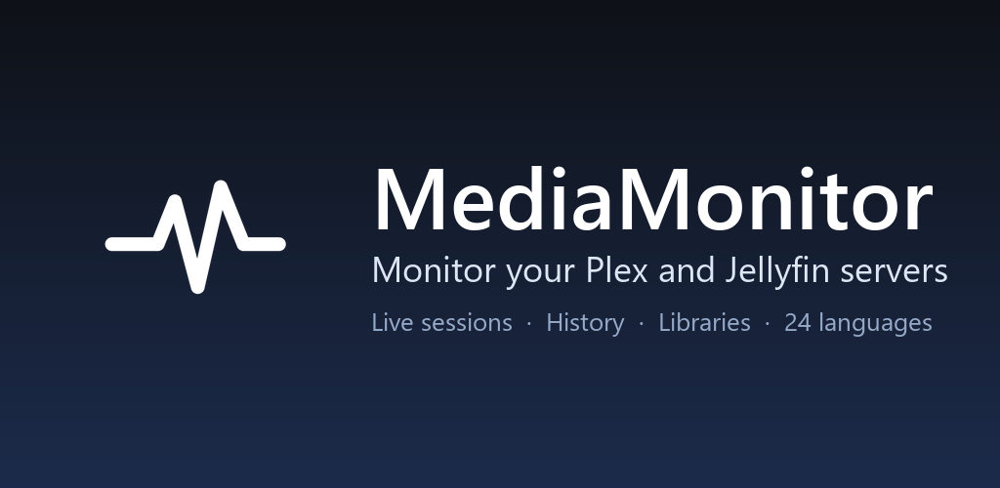

# Play Store assets

Visual assets used on the MediaMonitor [Google Play Store listing](https://play.google.com/store/apps/details?id=com.mediamonitor.media_monitor).

## Feature graphic

Banner displayed at the top of the store listing (1024x500, mandatory).

## Screenshots

Phone screenshots (1080x2400 portrait), shown in the order they appear on the listing.

| # | Name | Content |
|---|---|---|
| 00 | [Cover](playstore-00-cover.png) | Marketing cover with logo and tagline |
| 01 | [Sessions](playstore-01-sessions-actives.jpg) | Live sessions across Plex and Jellyfin servers |
| 02 | [Choose servers](playstore-02-choose-servers.jpg) | Onboarding: pick the server types to connect |
| 03 | [Languages](playstore-03-onboarding-langues.jpg) | First-launch language selector (24 languages) |
| 04 | [History](playstore-04-historique.jpg) | Unified playback history with movie posters |
| 05 | [Servers](playstore-05-serveurs-bibliotheques.jpg) | Connected servers and library stats |
| 06 | [Notifications](playstore-06-notifications.jpg) | Background notifications settings |

IP addresses visible on the sessions screenshot have been blurred for privacy.
